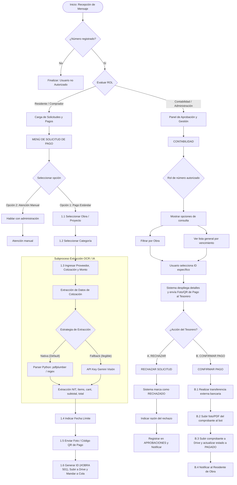

# 03 - Flujo de Procesos del Bot

Este documento detalla el **flujo conversacional y operacional** del sistema, reflejando fielmente la lógica de interacción diseñada para el canal de WhatsApp.

---

## 1. Diagrama de Flujo Principal (Mermaid)

---

## 2. Descripción Detallada de Pasos

### 2.1 Autenticación e Invocación
- **Evento:** El bot recibe una carga útil (payload) del webhook de Meta WhatsApp Cloud API.
- **Validación:** Compara el `telefono` en formato E.164 (ej: `+59170000000`) contra la tabla `USUARIOS`.
- **Resultado:** Si no existe, responde con un mensaje indicando que el número no está autorizado.

### 2.2 Menú Residente / Comprador
- **Seleccionar Obra:** El bot despliega una lista interactiva de obras activas asociadas al usuario desde la tabla `PROYECTOS`.
- **Seleccionar Categoría:** Despliega las categorías de gasto/material desde `CATEGORIAS`.
- **Carga de Cotización:** El residente adjunta la cotización (documento PDF o foto).
  - El archivo se guarda temporalmente, se extraen sus metadatos y se ejecuta el extractor OCR.
- **Fecha Límite:** El usuario ingresa la fecha máxima para efectuar el pago (formato legible o mediante selección).
- **Foto/QR de Pago:** El residente envía la imagen del código QR bancario o los datos de la cuenta de destino.
- **Confirmación:** El bot genera un código visible para el usuario (ej: `#OBRA-501`), almacena los archivos en Google Drive en la carpeta `Drive/[Nombre_Proyecto]/Cotizaciones/` y crea el registro en `COMPRAS` con estado `PENDIENTE`.

### 2.3 Menú Contabilidad / Tesorería
- **Panel de Control:** El tesorero consulta compras pendientes filtrando por **Obra** o por **Fecha de Vencimiento**.
- **Vista de Detalle:** El bot envía una ficha resumen con:
  - Nombre del Proveedor y NIT.
  - Lista de Ítems extraídos (cantidad, precio unitario, subtotal).
  - Total a pagar y Fecha Límite.
  - La imagen del **QR de Pago** para escaneo directo.
- **Rechazo:** Se le solicita un motivo de texto que se guarda en la tabla `APROBACIONES` y se notifica de inmediato al residente.
- **Confirmación:** Tras transferir en su banca electrónica, el tesorero envía la imagen del comprobante de transferencia al bot. El bot la sube a Google Drive (`Drive/[Nombre_Proyecto]/Comprobantes_Pago/`), actualiza la compra a `PAGADO` y notifica al residente.
