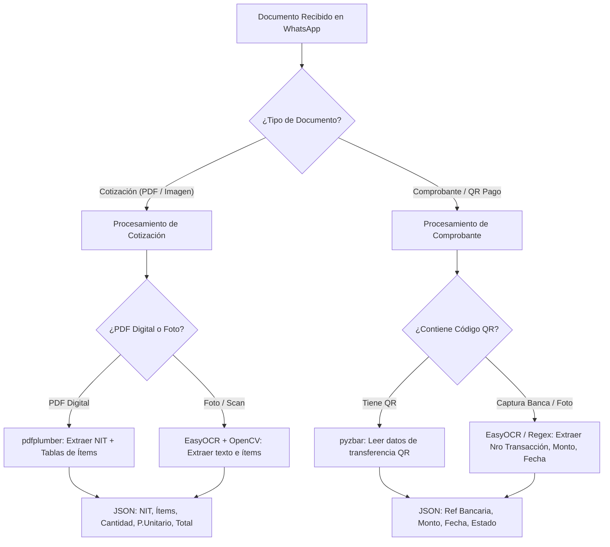

# 09 - Estrategia de Extracción de Datos en Python (Cotizaciones y Comprobantes de Pago)

Este documento analiza en detalle el **ecosistema completo de herramientas de Python** para la extracción de datos tanto de **Cotizaciones** (tablas, NIT, ítems, precios) como de **Comprobantes de Pago** (transferencias bancarias, fotos, capturas de pantalla, códigos QR).

---

## 1. Comparativa de Tecnologías Python para Extracción

Dividimos las tecnologías de Python según el formato de origen del documento:

### 1.1 Documentos PDF Digitales (Cotizaciones en Vector / PDF Original)

| Biblioteca Python | Tipo | Fortalezas | Cuándo Usarla |
| :--- | :--- | :--- | :--- |
| **`pdfplumber`** | Parser Tabular | • Extracción precisa de bordes de tabla.<br>• Extrae posición X,Y de cada palabra.<br>• Excelente rendimiento en Vercel. | **Recomendada #1** para cotizaciones digitales con tablas de insumos. |
| **`PyMuPDF` (`fitz`)** | Renderer & Text | • El parser de PDF más rápido en Python.<br>• Extrae texto e imágenes incrustadas en milisegundos. | Ideal para lectura ultrasónica de metadatos y conversión rápida a imágenes. |
| **`pypdf`** | Parser Ligero | • Biblioteca estándar en Python sin dependencias C. | Lectura básica de texto y división/combinación de archivos. |
| **`camelot-py`** | Extractor de Tablas | • Convierte tablas PDF directamente a DataFrames de Pandas. | Cotizaciones con estructuras de cuadrícula muy complejas. |

---

### 1.2 Imágenes, Fotos y Escaneos (Cotizaciones Impresas, Capturas de Banca Móvil)

| Biblioteca Python | Tipo | Fortalezas | Cuándo Usarla |
| :--- | :--- | :--- | :--- |
| **`EasyOCR`** | Deep Learning OCR | • Basado en PyTorch.<br>• Gran precisión en texto en español y números en fotos tomadas con el celular. | **Recomendada #1** para procesar fotos de comprobantes o cotizaciones físicas. |
| **`PaddleOCR`** | OCR & Layout Engine | • Incluye `PP-Structure` para reconocer tablas dentro de fotos.<br>• Muy alto desempeño en números y NIT. | Ideal si se requiere procesar tablas en documentos impresos/escaneados. |
| **`pytesseract`** | OCR Tradicional | • Envoltorio de Tesseract C++.<br>• Muy liviano en memoria. | Buena opción offline si Tesseract está instalado en el sistema. |
| **`OpenCV` (`opencv-python`)** | Preprocesamiento | • Binarización, corrección de inclinación (deskewing) y eliminación de ruido visual. | Esencial para limpiar la foto antes de enviarla a EasyOCR/PaddleOCR. |
| **`pyzbar` / `zxing-cpp`** | Lectura de QR | • Detecta y decodifica códigos QR en comprobantes o facturas. | Extraer automáticamente el hash/URL del QR de pago bancario. |

---

### 1.3 Parseo, Reglas y Validación de Datos (Python Nativo)

| Biblioteca Python | Uso Específico |
| :--- | :--- |
| **`re` (Regular Expressions)** | Identificación de patrones numéricos: NIT, montos en moneda (`Bs`, `$`, `BOB`), códigos de transacción bancaria y fechas. |
| **`Pydantic v2`** | Tipado y validación de datos extraídos para garantizar que precios y cantidades sean decimales válidos. |
| **`python-dateutil`** | Normalización de fechas de vencimiento ingresadas en múltiples formatos (ej: `31/07/2026`, `2026-07-31`). |

---

## 2. Diferenciación: Cotización vs Comprobante de Pago



---

## 3. Ejemplo de Código Python para Comprobantes de Pago Bancario (`bank_receipt_parser.py`)

A continuación se presenta el extractor específico para comprobantes de transferencia bancaria y lectura de QR:

```python
import re
from typing import Optional
from pydantic import BaseModel
import cv2
from pyzbar.pyzbar import decode
from PIL import Image

class ComprobantePagoExtraido(BaseModel):
    numero_transaccion: Optional[str] = None
    monto_transferido: float = 0.0
    fecha_transaccion: Optional[str] = None
    qr_contenido: Optional[str] = None
    es_valido: bool = False

class BankReceiptParser:
    @staticmethod
    def leer_qr_codigo(image_path: str) -> Optional[str]:
        """Detecta y decodifica un código QR presente en la foto del comprobante."""
        img = Image.open(image_path)
        decoded_objs = decode(img)
        for obj in decoded_objs:
            if obj.type == 'QRCODE':
                return obj.data.decode('utf-8')
        return None

    @staticmethod
    def procesar_captura_bancaria(texto_ocr: str) -> ComprobantePagoExtraido:
        """Extrae el número de comprobante, monto y fecha desde el texto reconocido."""
        # 1. Regex para Número de Transacción / Referencia
        trans_pattern = r"(?:Nro|Nº|Ref|Transacción|Comprobante)[:\s]*([A-Z0-9]{6,20})"
        match_trans = re.search(trans_pattern, texto_ocr, re.IGNORECASE)
        nro_trans = match_trans.group(1) if match_trans else None

        # 2. Regex para Monto (ej: 1,500.00 u 850.50)
        monto_pattern = r"(?:Monto|Total|Importe|Bs|\$)[:\s]*([0-9.,]+)"
        match_monto = re.search(monto_pattern, texto_ocr, re.IGNORECASE)
        monto = 0.0
        if match_monto:
            try:
                monto_str = match_monto.group(1).replace(".", "").replace(",", ".")
                monto = float(re.sub(r"[^\d.]", "", monto_str))
            except ValueError:
                pass

        # 3. Regex para Fecha (DD/MM/YYYY)
        fecha_pattern = r"(\d{2}[/-]\d{2}[/-]\d{4})"
        match_fecha = re.search(fecha_pattern, texto_ocr)
        fecha = match_fecha.group(1) if match_fecha else None

        es_valido = (monto > 0) or (nro_trans is not None)

        return ComprobantePagoExtraido(
            numero_transaccion=nro_trans,
            monto_transferido=monto,
            fecha_transaccion=fecha,
            es_valido=es_valido
        )
```

---

## 4. Matriz de Recomendación Final para Python

1. **Para Cotizaciones Digitales (PDFs enviados por proveedores):**
   - **`pdfplumber` + `re`**: Máxima velocidad, precisión perfecta en columnas de ítems y costo cero.
2. **Para Fotos de Cotizaciones / Facturas Impresas:**
   - **`EasyOCR` / `PaddleOCR` + `OpenCV`**: Excelente lectura de texto impreso y montos desalineados.
3. **Para Comprobantes de Pago / Capturas de Banca Móvil:**
   - **`pyzbar` (para decodificar QRs)** + **`EasyOCR` + `re`** (para extraer nro. de transacción, fecha y monto).
4. **Fallback a IA (Google Gemini API):**
   - Se mantiene únicamente para documentos donde las bibliotecas de Python anteriores obtengan una confianza `< 80%` (documentos borrosos o hechos a mano).
