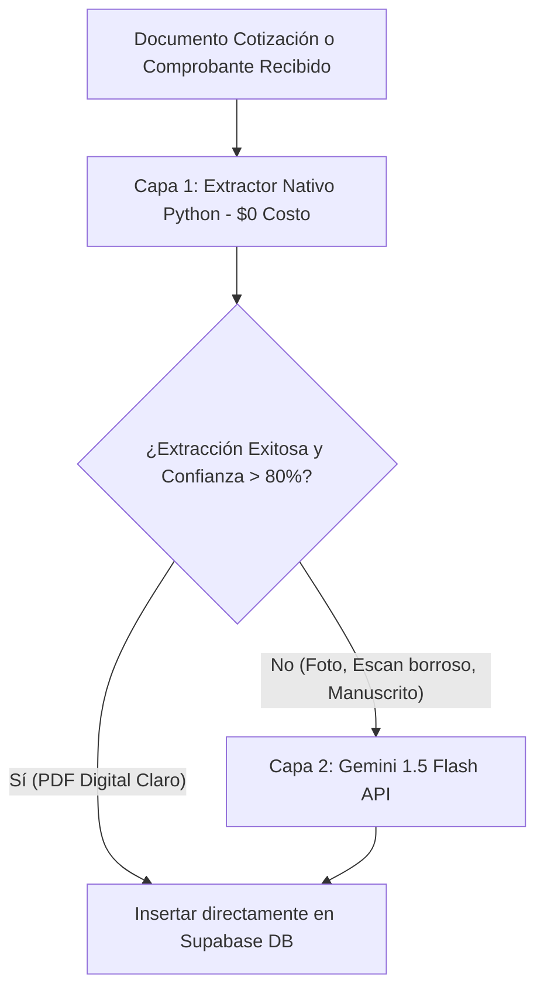

# 12 - Análisis de Costos, Ventajas, Desventajas y Recomendación de IA/Storage

Este documento presenta una evaluación detallada de **costos, ventajas, desventajas y nivel de complejidad** tanto para el **Almacenamiento de Archivos** como para los **Modelos de Inteligencia Artificial / OCR** aplicados a la extracción de datos de cotizaciones y comprobantes de pago.

---

## 🟢 PARTE 1: Almacenamiento de Archivos (Storage)

### 1.1 Comparativa Exhaustiva de Costos y Complejidad

| Almacenamiento | Plan Gratuito (Free Tier) | Costo por GB Adicional | Costo Transferencia (Descarga) | Complejidad Técnico/Setup | Ventajas Clave | Desventajas Clave |
| :--- | :--- | :--- | :--- | :--- | :--- | :--- |
| **Google Drive API** | 15 GB gratis (Cuenta personal) | Google Workspace: $6 - $12 / usuario / mes (30 GB - 2 TB) | $0.12 / GB (si usas Google Cloud Storage API) | **Media (3/5)** (Requiere Service Account y OAuth 2.0) | • El equipo administrativo puede ver las carpetas en una app conocida. • Fácil de compartir manualmente. | • Límites de cuota por segundo de API (Rate limits). • Setup de permisos en Google Cloud Console. |
| **Supabase Storage** | **1 GB Gratis** | $0.021 / GB / mes | $0.09 / GB | **Muy Baja (1/5)** (Usa el mismo SDK de Supabase DB) | • **100% Integrado con tu DB Supabase**. • Cero APIs de terceros adicionales. • Permisos integrados con la base de datos (RLS). | • No tiene aplicación de escritorio tipo "Windows Explorer" (se navega por panel web o links). |
| **Cloudflare R2** | **10 GB Gratis / mes** | $0.015 / GB / mes | **$0.00 / GB ($0 Egress sin costo)** | **Baja (2/5)** (Compatible con S3 API) | • **Cero costo de transferencia de datos**. • La opción más económica a gran escala. | • Requiere configurar un bucket S3. |
| **AWS S3** | 5 GB Gratis (12 meses) | $0.023 / GB / mes | $0.09 / GB | **Alta (4/5)** (Requiere IAM Roles y políticas AWS) | • Estándar de la industria mundial. • Durabilidad 99.999999999%. | • Facturación compleja y cobro por cada petición HTTP (PUT/GET). |
| **OneDrive / SharePoint** | Incluido en Microsoft 365 | Planes M365 Business desde $6.00 / usuario / mes (1 TB) | Incluido en la suscripción | **Alta (4/5)** (Azure AD OAuth 2.0 Microsoft Graph) | • Sincronización nativa con el explorador de archivos de Windows de la empresa. | • La API de Microsoft Graph es compleja de implementar. |

#### 💡 Recomendación Final de Almacenamiento para Ecoartec:
1. **Fase 1 (Inicio rápido):** **Supabase Storage**. Utiliza exactamente el mismo token y cliente de Supabase que ya tienes configurado en Next.js.
2. **Si el área contable exige ver archivos en su PC como carpetas normales:** Usa **Google Drive** o **OneDrive**.

---

## 🧠 PARTE 2: Inteligencia Artificial y OCR (Extracción de Cotizaciones y Comprobantes)

Para extraer datos de **Cotizaciones** (tablas, NIT, ítems, precios) y **Comprobantes de Pago** (transferencias bancarias, QRs, fechas, montos), comparamos los 3 enfoques tecnológicos:

1. **Python Nativo (Sin IA)** -> Algoritmos `pdfplumber` + `EasyOCR` + `re` + `pyzbar`.
2. **APIs de IA en la Nube (Cloud AI)** -> Google Gemini Visión / OpenAI GPT-4o-mini.
3. **Modelos de IA Locales (Offline AI)** -> LLaVA / Llama 3.2 Vision en servidor propio con GPU.

---

### 2.1 Tabla Comparativa: Python Nativo vs Cloud AI APIs vs Modelos Locales

| Criterio | Python Nativo (Algorítmico) | Cloud AI API: Google Gemini Flash / GPT-4o-mini | Modelo Local con GPU (Ollama / Llama 3.2 Vision) |
| :--- | :--- | :--- | :--- |
| **Costo por 1,000 Documentos** | **$0.00 USD (Totalmente Gratis)** | **~$0.15 a $0.30 USD** (Casi imperceptible) | **$150 - $300 USD / mes** (Costo de servidor con GPU dedicada) |
| **Tasa de Éxito en PDFs Digitales** | **90% - 95%** (Excelente para PDFs claros) | **99%** (Extrae cualquier estructura) | **90% - 95%** (Depende del modelo VLM) |
| **Tasa de Éxito en Fotos / Scans Borrosos** | 40% - 50% (Sufre con baja luz o inclinación) | **98%** (Entiende fotos arrugadas, con sombras o manuscritas) | 80% - 85% (Requiere modelos VLM de +11B parámetros) |
| **Tiempo de Respuesta (Latencia)** | **< 1 segundo** (Ultra rápido) | **1 a 2 segundos** | 4 a 12 segundos (Depende de la GPU) |
| **Requerimientos de Infraestructura** | Ninguno (Corre directo en Vercel Serverless) | Ninguno (Solo requiere una API Key) | **Servidor GPU Obligatorio** (NVIDIA RTX 3090/4090 con 24GB VRAM). **Imposible en Vercel**. |
| **Formato de Salida** | Requiere expresiones regulares personalizadas | **JSON nativo perfecto** con validación Pydantic / Zod | JSON estructurado (requiere prompting estricto) |
| **Complejidad de Mantenimiento** | **Baja** (Mantener código regex) | **Muy Baja** (Mantenimiento cero) | **Muy Alta** (Mantenimiento de servidor GPU, drivers CUDA, Ollama) |

---

### 2.2 Desglose Estregado por Modelo/API

#### 1. Google Gemini 1.5 Flash / Gemini 2.0 Flash (RECOMENDACIÓN #1 DE IA EN LA NUBE)
- **Costo Exacto:** $0.075 USD por millón de tokens de entrada / $0.30 USD por millón de tokens de salida.
- **Costo Real por Cotización:** ~$0.00015 USD (Procesar 1,000 cotizaciones/comprobantes al mes cuesta **menos de $0.20 USD**).
- **Ventajas:**
  - Es la API de Visión multimodal más económica y rápida del mercado.
  - Genera automáticamente esquemas JSON estrictos para insertar directamente en Supabase DB.
  - Soporta imágenes de alta resolución de cotizaciones impresas o facturas manuscritas.
- **Desventajas:** Dependencia de la API de Google.

#### 2. OpenAI GPT-4o-mini
- **Costo Exacto:** $0.15 USD / 1M input tokens. ~$0.50 USD por 1,000 documentos.
- **Ventajas:** Excelente soporte para Structured Outputs.
- **Desventajas:** 2x a 3x más costoso que Gemini Flash para procesamiento de imágenes.

#### 3. Modelos Locales (Llama 3.2 Vision 11B / Qwen2-VL / LLaVA en Ollama)
- **Costo de Hardware:** Requiere alquilar un VPS con GPU (ej: RunPod / Lambda Labs / Vast.ai) a ~$0.30 USD/hora = **~$200 USD al mes**.
- **Ventajas:** Privacidad 100% local (los datos de las compras nunca salen de tu servidor).
- **Desventajas:**
  - Costoso para un volumen inicial de compras.
  - Vercel no soporta GPUs; requeriría alojar un servidor independiente en Linux con PyTorch/Ollama y conectarlo a Next.js.
  - Latencia más alta (4-8 segundos por imagen).

---

## 🏆 RECOMENDACIÓN TÉCNICA ESTRATÉGICA PARA ECOARTEC

Para lograr la **máxima eficiencia operativa, costo mínimo y cero fallos**, recomendamos la **Estrategia Híbrida de 2 Capas**:

### ¿Por qué esta estrategia es la mejor?
1. **80% de tus documentos se procesan a costo $0** y en menos de 1 segundo mediante Python nativo (`pdfplumber` / `regex` / `pyzbar`).
2. **El 20% de documentos complejos (fotos borrosas) se derivan a Gemini Visión API**, costando menos de **$0.20 USD al mes**.
3. **No pagas $200/mes por servidores de GPU locales** ni te preocupas por infraestructura compleja.
